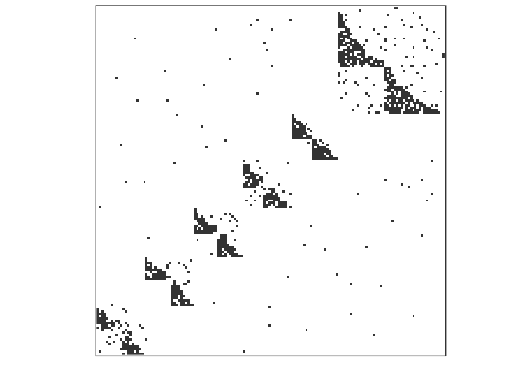
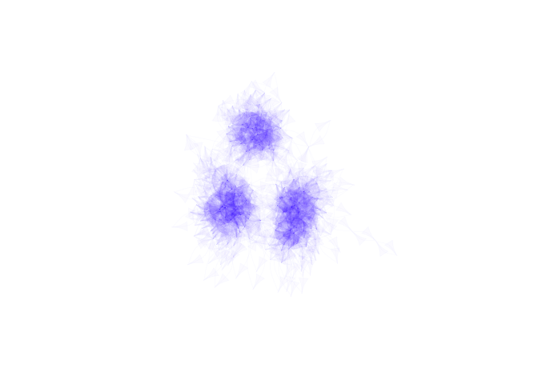
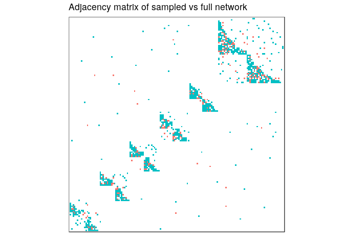
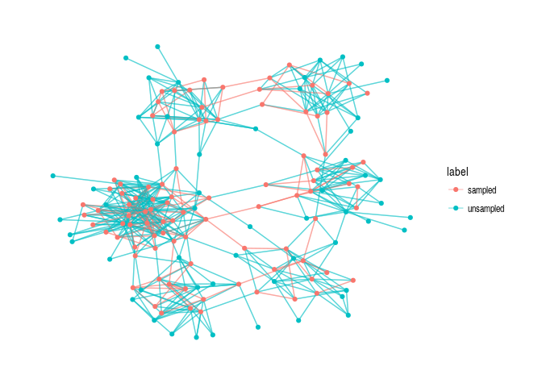

EcoNetGen
================

[](https://travis-ci.org/cboettig/EcoNetGen) [](https://ci.appveyor.com/project/cboettig/EcoNetGen) [](https://codecov.io/github/cboettig/EcoNetGen?branch=master) [](https://cran.r-project.org/package=EcoNetGen) [](https://www.tidyverse.org/lifecycle/#maturing) [](https://zenodo.org/badge/latestdoi/116610054)

<!-- README.md is generated from README.Rmd. Please edit that file -->
Installation
------------

You can install EcoNetGen from github with:

``` r
# install.packages("devtools")
devtools::install_github("cboettig/EcoNetGen")
```

Generate random networks
------------------------

This is a basic example which generates a network. See `?netgen` for documentation describing the parameter arguments.

``` r
library(EcoNetGen)
set.seed(123456) # for a reproducible simulation
network <- netgen(n_modav = c(150, 20), # network size, ave module size
                  cutoffs = c(20, 5),   # module and submodule min sizes
                  net_type = 41,        # bi-partite nested
                  net_degree = 10,      # average degree of connection
                  net_rewire = c(0.07,0.2)) # rewire probabilities
#> 
#> module count = 6 
#> average degree = 6.74666666666667 
#> average module size = 25 
#> number of components = 1 
#> size of largest component = 150
```

We can plot the resulting `igraph` as an adjacency matrix:

``` r
adj_plot(network)
```



Network `igraph` objects can also be plotted using the standard `igraph` plotting routines, for example:

``` r
library(igraph)
#> 
#> Attaching package: 'igraph'
#> The following objects are masked from 'package:stats':
#> 
#>     decompose, spectrum
#> The following object is masked from 'package:base':
#> 
#>     union
plot(network, vertex.size= 0, vertex.label=NA, 
     edge.color = rgb(.22,0,1,.02), vertex.shape="none", 
     edge.curved =TRUE, layout = layout_with_kk)
```



Sample from a network
---------------------

``` r
subnet <- netsample(network,
                 crit = c(4,0), # Sample key nodes by degree, neighbors randomly
                 key_nodes = c(50, 50, 10, 1000),
                 anfn = 0.5, # samples 50% of neighbors
                 numb_hidden = 0,
                 hidden_modules = c(0,0,0,0,0,0,0,0,0,0)
                 )
```

We can plot the adjacency network, coloring red the sampled nodes. Note that `adj_plot` objects are just `ggplot` graphs (`geom_raster`) under the hood, and can be modified with the usual `ggplot` arguments, such as adding a title here.

``` r
library(ggplot2)
adj_plot(subnet) + ggtitle("Adjacency matrix of sampled vs full network")
```



Don't forget to check out the `ggraph` package, which isn't required for `EcoNetGen` but provides a lot of additional great ways to plot your network. Here we plot the simulated network color-coding the sampled nodes and edges (indicated by the label "sampled" on vertices and edges):

``` r
library(ggraph)
ggraph(subnet, layout = 'kk') +
        geom_edge_link(aes(colour = label, lwd = label), alpha=0.4) +
        geom_node_point(aes(colour = label)) +
        theme_graph()
#> Warning: Ignoring unknown aesthetics: edge_size
```



A few example statistics
------------------------

And we can compute common statistics from igraph as well. Here we confirm that clustering by "edge betweeness" gives us the expected number of modules:

``` r
community <- cluster_edge_betweenness(as.undirected(network))
length(groups(community))
#> [1] 6
```

We can check the size of each module as well:

``` r
module_sizes <- sapply(groups(community), length)
module_sizes
#>  1  2  3  4  5  6 
#> 20 21 22 21 20 46
mean(module_sizes)
#> [1] 25
```

``` r
mean(degree(as.undirected(network)))
#> [1] 6.786667
```
