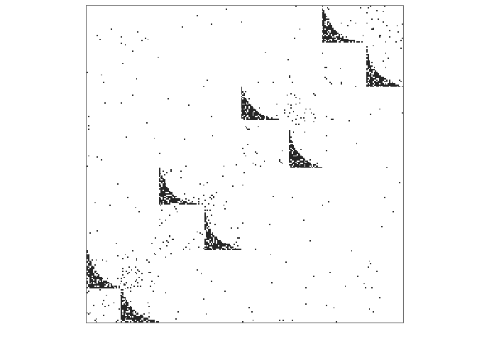
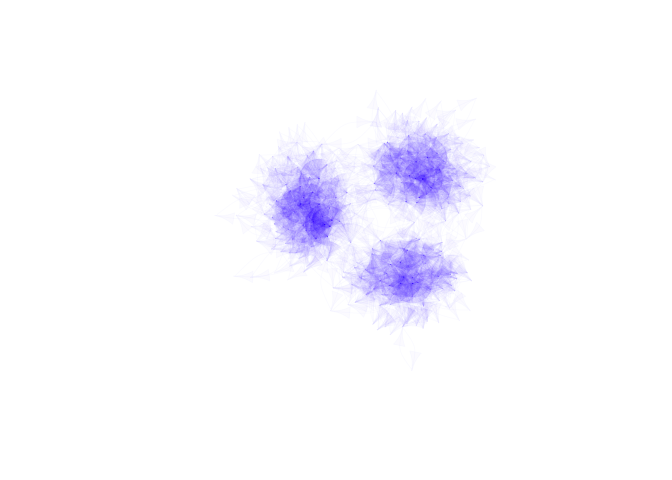

[](https://travis-ci.org/cboettig/EcoNetGen)
[](https://ci.appveyor.com/project/cboettig/EcoNetGen)
[](https://codecov.io/github/cboettig/EcoNetGen?branch=master)
[](https://cran.r-project.org/package=EcoNetGen)
[](https://www.tidyverse.org/lifecycle/#experimental)

<!-- README.md is generated from README.Rmd. Please edit that file -->

# EcoNetGen

## Installation

You can install EcoNetGen from github with:

``` r
# install.packages("devtools")
devtools::install_github("cboettig/EcoNetGen")
```

## Example

This is a basic example which generates a network. See `?netgen` for
documentation describing the parameter arguments.

``` r
library(EcoNetGen)
network <- netgen(n_modav = c(250, 20), 
                  cutoffs = c(50, 5), 
                  net_type = 41, 
                  net_degree = 10,
                  net_rewire = c(0.07,0.2),
                  mod_probs = c(0.2, 0.0, 0.3, 0.3, 0.2, 0.0, 0.0))
#> 
#> module count = 3 
#> average degree = 9.932 
#> average module size = 83.3333333333333 
#> number of components = 1 
#> size of largest component = 250
```

We can plot the resulting `igraph` as an adjacency matrix:

``` r
adj_plot(network)
```

<!-- -->

Network `igraph` objects can also be plotted using the standard `igraph`
plotting routines, for example:

``` r
library(igraph)
#> 
#> Attaching package: 'igraph'
#> The following objects are masked from 'package:stats':
#> 
#>     decompose, spectrum
#> The following object is masked from 'package:base':
#> 
#>     union
plot(network, vertex.size= 0, vertex.label=NA, 
     edge.color = rgb(.22,0,1,.02), vertex.shape="none", 
     edge.curved =TRUE, layout = layout_with_kk)
```

<!-- -->

And we can compute common statistics from igraph as well. Here we
confirm that clustering by “edge betweeness” gives us the expected
number of modules:

``` r
community <- cluster_edge_betweenness(as.undirected(network))
length(groups(community))
#> [1] 3
```

We can check the size of each module as well:

``` r
module_sizes <- sapply(groups(community), length)
module_sizes
#>  1  2  3 
#> 82 72 96
mean(module_sizes)
#> [1] 83.33333
```

``` r
mean(degree(as.undirected(network)))
#> [1] 9.952
```
